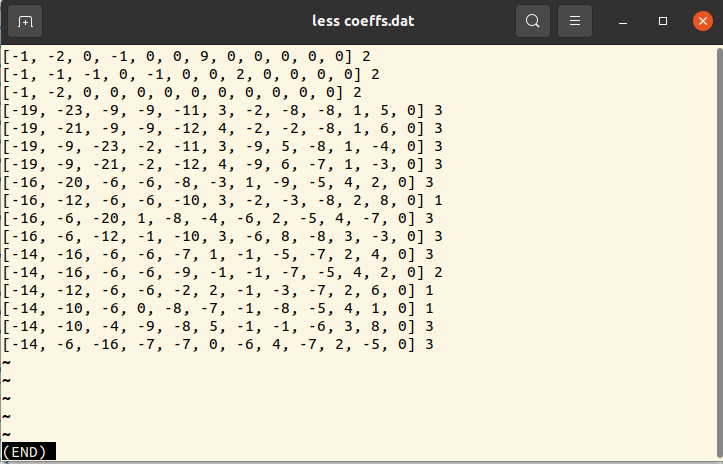

---
title: "Command Line: More powerful than you might think"
subtitle: 
summary: 'The UNIX command line is a powerful tool. It can do much more than just executing programs and renaming files. Here, we have a quick dive into some functions that can make your everyday life much easier'
authors:
  - admin
tags: ['Tools','Linux']
categories: []
projects: []
draft: false
featured: false
share: false
date: '2023-11-18T00:00:00Z'
lastMod: '2023-11-18T00:00:00Z'
image:
  caption: 'generated by DALL-E'
  focal_point: ''
  preview_only: true
---  
Sometimes, it might feel a bit old-school to use the Linux command line directly for data analysis. (Yes, the commands in this article work only for UNIX based systems. Sorry Windows users...)
However, some quick and dirty tasks are just perfectly suited for some command-line tools that are just installed on almost every Linux machine.

This post is not an extensive review over the capabilities of the bash programming language or the command line.
It is rather a show-case of how some basic knowledge of the command line can make your life much easier.

# The setting
Imagine you have some simulation data lying around that a colleague of yours produced a while ago.
It might look something like this:
```
[-1, -2, 0, -1, 0, 0, 9, 0, 0, 0, 0, 0] 2
[-1, -1, -1, 0, -1, 0, 0, 2, 0, 0, 0, 0] 2
[-1, -2, 0, 0, 0, 0, 0, 0, 0, 0, 0, 0] 2
[-19, -23, -9, -9, -11, 3, -2, -8, -8, 1, 5, 0] 3
[-19, -21, -9, -9, -12, 4, -2, -2, -8, 1, 6, 0] 3
[-19, -9, -23, -2, -11, 3, -9, 5, -8, 1, -4, 0] 3
[-19, -9, -21, -2, -12, 4, -9, 6, -7, 1, -3, 0] 3
[-16, -20, -6, -6, -8, -3, 1, -9, -5, 4, 2, 0] 3
[-16, -12, -6, -6, -10, 3, -2, -3, -8, 2, 8, 0] 1
[-16, -6, -20, 1, -8, -4, -6, 2, -5, 4, -7, 0] 3
[-16, -6, -12, -1, -10, 3, -6, 8, -8, 3, -3, 0] 3
[-14, -16, -6, -6, -7, 1, -1, -5, -7, 2, 4, 0] 3
[-14, -16, -6, -6, -9, -1, -1, -7, -5, 4, 2, 0] 2
[-14, -12, -6, -6, -2, 2, -1, -3, -7, 2, 6, 0] 1
[-14, -10, -6, 0, -8, -7, -1, -8, -5, 4, 1, 0] 1
[-14, -10, -4, -9, -8, 5, -1, -1, -6, 3, 8, 0] 3
[-14, -6, -16, -7, -7, 0, -6, 4, -7, 2, -5, 0] 3
< and some 30K more lines >
```
The numbers in parentheses are some coefficients and the number behind at the end of each line is a classification result.

Here, we are going to work with this short version of the file.
You can download it [here](coeffs.dat).

# Using the command line

For an in-depth data analysis, Python is the obvious choice.
Load the data with `pandas` and start analyzing away.

However, maybe you want to get a quick, first impression of the data.
The command line could give you exactly that.
Let's see how that works.

For the rest of the blog post, I assume that you are using some UNIX command line.
None of the commands will be specific to a special shell (like `bash` or `zsh`).
If you are using Windows, well, ... There is the [subsystem of Linux](https://learn.microsoft.com/en-us/windows/wsl/install).

## Getting to know the file
In a first step, we can get a general overview of the file with commands like `less` or `cat`.
Both commands display the contents of the file in the command line.
While `cat` actually con*cat*enates the contents to the terminal, `less` opens a scrollable viewer.
This is especially useful for longer files.


To leave the `less` viewer again press `q`. The commands in less are somewhat similar to the commands available `vim`.
You can search with `/`, scroll with `j` and `k`. For a full overview of all commands, press `h` in `less`.

Fun fact: the command `tac` (`cat` backwards) prints a file backwards...

Sometimes, it is not really interesting to view the full file, but we are only interested the first or last couple of lines.
The commands `head coeffs.dat` and `tail coeffs.dat` will plot the first and last couple of lines.
The option `-n` sets the number of printed lines for both commands.

Finally, we might be interested in the length of the file, i.e. the number of lines, the number of words or the number of characters.
The program *w*ord *c*ount got you covered. 
By calling `wc coeffs.dat`, we obtain
```bash
 16 221 818 coeffs.dat
```
The file has 16 lines, 221 words and 818 characters.
For details on the output format, have a look at the *man*ual under `man wc`.

In general, the `man`-pages are an excellent spot to look for details on a command.

## Filtering and Sorting
The file `coeffs.dat` contains coefficients for many different classes.
The class is indicated by the last column.

If we are only interested in a single class, it would great if we could just output the lines for a certain class.
Luckily, `grep` got you covered.

The call `grep '] 3' coeffs.dat` filters only those lines from `coeffs.dat` that contain the pattern `'] 3'`.
Since each lines contains only one closing bracket at the end, the filter will work only on the class indicator.
As an output, we get
```bash
[-19, -23, -9, -9, -11, 3, -2, -8, -8, 1, 5, 0] 3
[-19, -21, -9, -9, -12, 4, -2, -2, -8, 1, 6, 0] 3
[-19, -9, -23, -2, -11, 3, -9, 5, -8, 1, -4, 0] 3
[-19, -9, -21, -2, -12, 4, -9, 6, -7, 1, -3, 0] 3
[-16, -20, -6, -6, -8, -3, 1, -9, -5, 4, 2, 0] 3
[-16, -6, -20, 1, -8, -4, -6, 2, -5, 4, -7, 0] 3
[-16, -6, -12, -1, -10, 3, -6, 8, -8, 3, -3, 0] 3
[-14, -16, -6, -6, -7, 1, -1, -5, -7, 2, 4, 0] 3
[-14, -10, -4, -9, -8, 5, -1, -1, -6, 3, 8, 0] 3
[-14, -6, -16, -7, -7, 0, -6, 4, -7, 2, -5, 0] 3
```

`grep` does not only inclusive support searching, but also exclusive searching.
You can print all lines that *do not* contain the pattern.
The command `grep -v '] 3' coeffs.dat` prints all lines that *do not* belong to class 3.
In this case, it is all other lines:
```bash
[-1, -2, 0, -1, 0, 0, 9, 0, 0, 0, 0, 0] 2
[-1, -1, -1, 0, -1, 0, 0, 2, 0, 0, 0, 0] 2
[-1, -2, 0, 0, 0, 0, 0, 0, 0, 0, 0, 0] 2
[-16, -12, -6, -6, -10, 3, -2, -3, -8, 2, 8, 0] 1
[-14, -16, -6, -6, -9, -1, -1, -7, -5, 4, 2, 0] 2
[-14, -12, -6, -6, -2, 2, -1, -3, -7, 2, 6, 0] 1
[-14, -10, -6, 0, -8, -7, -1, -8, -5, 4, 1, 0] 1
```

To get a better overview of the data, we can directly *pipe* this output to the next command.
The *pipe* character `|` takes the output of the left side and feeds it into the input of the right side.
If we want to sort the output of all class-3 outputs, we can call `grep '] 3' coeffs.dat | sort`
```bash
[-14, -10, -4, -9, -8, 5, -1, -1, -6, 3, 8, 0] 3
[-14, -16, -6, -6, -7, 1, -1, -5, -7, 2, 4, 0] 3
[-14, -6, -16, -7, -7, 0, -6, 4, -7, 2, -5, 0] 3
[-16, -20, -6, -6, -8, -3, 1, -9, -5, 4, 2, 0] 3
[-16, -6, -12, -1, -10, 3, -6, 8, -8, 3, -3, 0] 3
[-16, -6, -20, 1, -8, -4, -6, 2, -5, 4, -7, 0] 3
[-19, -21, -9, -9, -12, 4, -2, -2, -8, 1, 6, 0] 3
[-19, -23, -9, -9, -11, 3, -2, -8, -8, 1, 5, 0] 3
[-19, -9, -21, -2, -12, 4, -9, 6, -7, 1, -3, 0] 3
[-19, -9, -23, -2, -11, 3, -9, 5, -8, 1, -4, 0] 3
```
The `sort` command sorts lexicographically. Numbers like 1, 30, 100 will be sorted as 1, 100, 30 because 100 begins with the smaller number.
This default behavior can be adapted with the option `-n`.

Finally, it would be handy to write the filtered data back to a file.
The character `>` directs the standard output `stdout` that is usually displayed on the console to a file.
The command `grep '] 3' coeffs.dat | sort > coeffs_cls_3_sorted.dat` writes the sorted output for class 3 to a file `called coeffs_cls_3_sorted.dat`.

# Commands in this blog post
- `man <cmd>`: Print the manual page of the command `<cmd>`.
- `cat <fname>`: Con*cat*enate the contents of the file to the command line
- `tac <fname>`: Con*tac*enates the contents of a file to the command line in reversed order
- `wc <fname>`: Count the lines, words and characters in a file
- `tail <fname>`: Print the last lines of a file. Especially useful as `tail -f <fname>` to get a live update of a changing file.
- `head <fname>`: Print the first lines of a file.
- `grep 'pattern' <fname>`: Display all lines containing pattern in `<fname>`.
- `grep -v 'pattern' <fname>`: Display all lines *not* containing pattern in `<fname>`.
- `sort <fname>`: Sort the file's contents in lexicographical order.

# Reference
In case you are looking for a really well-written reference on the Linux command line, check out this book:

Brian W. Kernighan and Rob Pike. The UNIX programming environment. Prentice-Hall software series. Englewood Cliffs, N.J: Prentice-Hall, 1984. 357 pp. isbn: 978-0-13-937681-8.

It is one of the first books that I read about computers and it really changed the way that I think about the command line.