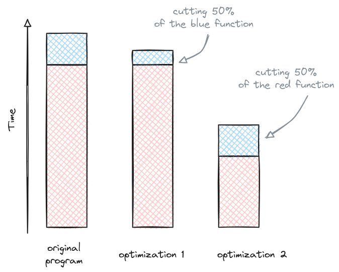

---
title: Profiling in Python
subtitle: 
summary: "My code needs to run faster... A feeling that most of us can relate to. But where to start? Profiling is the an important step to figure out where to your program spends time and what to optimize."
authors:
  - admin
tags: ['Tools','Python']
categories: []
projects: []
draft: false
featured: false
share: false
date: '2024-12-29T00:00:00Z'
lastMod: '2024-22-29T00:00:00Z'
image:
  caption: 'generated by DALL-E'
  focal_point: ''
  preview_only: true
---  

Can we make this run faster? A typical question when code is not as fast as one would have hoped.
Some issues in Python are easily fixed, like using `numpy` instead of explicit loops, but how do we start if all the usual wisdom is exhausted?

The answer is profiling! A profiler is a program that tracks the runtime of different functions and gives us an indication where time is wasted.

In this post, we will have a look at the [line_profiler](https://github.com/pyutils/line_profiler) and how we can use it to find bottlenecks in Python code.

# TL;DR
If you want to know which function takes the most time, install package `line_profiler` and add the following lines to the top of your script.
```python
import line_profiler
import atexit
profile = line_profiler.LineProfiler()
atexit.register(profile.print_stats)
```
If you add `@profile` as a decorator to the function of interest, you will obtain an overview of how long each lines takes after the program terminates.


# What to speed up?
The crucial question when optimizing is what to optimize.
The funny part about optimizing is that the function that you think is slow, might not even be the worst problem.
If a small function is called a lot of times, it might actually take more time in total than an expensive function which is called once during start-up.

I actually had a project where the `np.allclose` function slowed down a function running in a loop significantly. 
The main reason was that this simple check for equality has to be safe for all kind of types and eventualities.
By just rewriting it without all the checks and safety (we knew what we were putting in), we gained a significant factor from the execution time.

If one function takes 80% of the runtime, then it would certainly good to start optimizing that function.
An example is the red function in the illustration below.
It takes the biggest chunk of time. 
Cutting its runtime by half makes a much bigger impact than cutting the runtime of the blue function.
Profiling helps us to find the red function in our code.



# The magic lines
So, how do we get the timing information that we are after?
The answer is a profiler. 
In this post, we use the [`line_profiler` package](https://github.com/pyutils/line_profiler).

From a very practical perspective, you can just add the following line on top of your Python file:

```python
import line_profiler
import atexit
profile = line_profiler.LineProfiler()
atexit.register(profile.print_stats)
```

The first line imports the protagonist of this post, the `line_profiler` package.
The second line imports the module that will help us to print the results of the profiling run at the end of the program.
This is operation is registered in the fourth line of the code.
The third line instantiates a `LineProfiler` object that we will use for the profiling run.

Let's imagine we would want to time the function `foo` in our Python program.
We only have to add `@profile` as a decorator to the `foo` function:
```python
@profile
def foo():
    # <Some contents>
```
and we will get a full listing of how much time each line takes.

As a general rule, it is most convenient to start with a function high up in the hierarchy (like a `main` function) and then to specialize in subsequent runs.

When profiling code, it is important to find a reasonable use-case. If we try to cut the runtime too much, we might end up measuring too much of the start-up and optimize the wrong function.
On the other hand, running profiling runs for hours is not a good idea either.
There is a sweet spot to be found between accurate representation and time waiting.

# Other options
The `line_profiler` is not the only option to profile your code.
Other options are
- [Snake Viz](https://jiffyclub.github.io/snakeviz/) (Python)
- [perf](https://perfwiki.github.io/main/) (C++)
- [The scalasca suite](https://www.scalasca.org/) (C++)
- and many more...

I am just presenting the `line_profiler` here because it is my go-to tool for Python.

# A full code example
Here is a full code example. 
Admittedly, there have been more fascinating examples...
The result is pretty clear from the start: multiplying two matrices is computationally more demanding than adding two numbers.
However, it makes for an instructive example.

```python
import numpy as np
import line_profiler
import atexit
profile = line_profiler.LineProfiler()
atexit.register(profile.print_stats)

def matrix_mult(a, b):
    """
    Multiplies two matrices using NumPy's dot function.

    Parameters:
    a (array-like): The first matrix.
    b (array-like): The second matrix.

    Returns:
    numpy.ndarray: The result of the matrix multiplication.
    """
    return np.dot(a, b)

def add_numbers(a,b):
    """
    Adds two numbers together.

    Parameters:
    a (int): The first number.
    b (int): The second number.

    Returns:
    int: The result of the addition.
    """
    return a + b

@profile
def main():
    a = np.random.rand(1000, 1000)
    b = np.random.rand(1000, 1000)
    matrix_mult(a, b)
    add_numbers(1, 2)

main()
```

The result after executing the code:

```
Timer unit: 1e-09 s

Total time: 0.0432364 s
File: test_profile.py
Function: main at line 33

Line #      Hits         Time  Per Hit   % Time  Line Contents
==============================================================
    33                                           @profile
    34                                           def main():
    35         1   19112284.0    2e+07     44.2      a = np.random.rand(1000, 1000)
    36         1    8160212.0    8e+06     18.9      b = np.random.rand(1000, 1000)
    37         1   15954181.0    2e+07     36.9      matrix_mult(a, b)
    38         1       9698.0   9698.0      0.0      add_numbers(1, 2)

```

As expected, running a matrix-matrix multiplication of $1000\times 1000$ matrices is more expensive than the addition of two numbers.