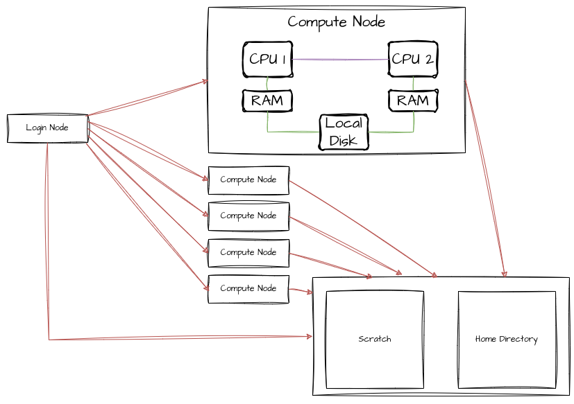

---
title: SLURM
summary: 'SLURM is a workload manager for clusters. It is distributes computing jobs to the available resources and makes sure that everybody gets a fair amount of computing resources.'
subtitle: Connections and Agents
authors:
  - admin
tags: ['Tools','Linux','Computing']
categories: []
projects: []
draft: false
featured: false
date: '2024-03-11T00:00:00Z'
lastMod: '2024-03-11T00:00:00Z'
image:
  caption: 'generated by DALL-E'
  focal_point: ''
  preview_only: true
---  

Lots of stuff to compute and only a laptop at hand? 
Don't worry, most probably your university has a compute cluster that can do most of the work for you.
Maybe, you already figured out how to connect to the cluster via 
[SSH]().
But how do we actually run a computation on a cluster?
This is what this post is about.

In this post, we focus on scientific clusters that manage workload with [SLURM](https://slurm.schedmd.com/documentation.html).

## TL;DR
- SLURM is a workload manager that makes sure that computations get the correct resources and that computation time is allocated fairly among users.
- Make sure jobs store data on the `scratch` or `data` partition of the cluster (if it has one) and don't write GB of data into your home directory. 
Usually, home directories are backed up and only have limited amount of storage available.
- `sbatch` submits an `sbatch`-formatted bash script to a compute node (recommended way to submit jobs).
- `srun <command>` executes the following `command` on a compute node of the cluster.
- `squeue` lists all currently running jobs

## Structure of a cluster
Compute clusters are a bit bigger than the average home computer.
The amount of main memory (RAM) of a cluster node can have the size of a normal hard drive (1TB of RAM is not unheard of).
Let's have a quick look at what a cluster looks under the hood.

Usually, you log into one or two special nodes of the cluster: the login nodes.
These nodes are not meant for computations, but for management tasks like small tests, compiling, moving data, etc.
They are also used to send jobs via the job management system, i.e. SLURM, to the compute nodes.
These are usually a bit beefier and do the actual heavy lifting.
Except for special cases, like debugging, there is usually no need to log into these compute nodes.
Usually, login and compute nodes have access to network storage.


The network storage is usually split in two parts: the `$HOME` partitions and scratch partition.
When working on the cluster, your `\$HOME` partition is backed up automatically.
However, it has only limited capacity.
If you are submitting compute jobs, you should move them to the scratch partition of the cluster.
For `xmaris`, one of the physics clusters in Leiden, it is located at `/marisdata/<username>`.
For `alice`, the Leiden university cluster, it is at `/data1/<username>`.
When you use it the first time, you might have to create the folder with your username.
There is (to my knowledge) no quota on this partition and its capacity is in the TB regime.
However, it is not back-up. 
So don't store anything here that you can't recalculate and move important data to `$HOME`.
Note, however, the home directory is rather small (approx. 10 GB)

For an example of the actual specifications of a cluster, have a look [here](\https://helpdesk.strw.leidenuniv.nl/wiki/doku.php?id=institute_lorentz:xmaris) for the `xmaris` compute cluster at the Lorentz Institute in Leiden or [here](https://pubappslu.atlassian.net/wiki/spaces/HPCWIKI/pages/37519378/About+ALICE#Hardware-Description) for `alice`.


## Running jobs
Most scientific clusters use [SLURM](https://slurm.schedmd.com/documentation.html) as a job management system. 
Here, we focus on giving a practical introduction to using SLURM.
If are looking for a more technical introduction, have a look [here](https://slurm.schedmd.com/tutorials.html).

The idea of a job system is that not everyone can work on the same node and that different jobs should be scheduled in such a way that the cluster is used most efficiently.
You use the login node to add jobs to the queue of jobs that will be executed on the compute nodes.

To use SLURM, we need a bit of vocabulary.
Let's go with a couple of hand-wavy definitions to get the idea across.

SLURM defines certain terms to manage the allocation of cluster resources.
The biggest chunk that you can allocate are one or multiple nodes.
A node has usually multiple CPUs each equipped with multiple processors.
Thus, if you allocate multiple nodes, you will have to implement some way to communicate over network (usually [MPI](https://www.open-mpi.org/)).
If you didn't do this, don't allocate multiple nodes for one job.

Starting multiple tasks you have to be able to communicate between multiple processes on the same node.
That is also usually done via MPI.

The last layer is allocating processors to a job.
Here, a processor refers to a physical core, not a packaged CPU.
The communication between multiple cores is usually managed by most libraries that you might be using (numpy, Lapack, BLAS, etc) via OpenMP or similar libraries.
Thus, allocating multiple cores for a job makes a lot of sense.


### Starting a job
Enough theory, let's start a job.  
The usual way to start a job is the `sbatch` command which is called with a script that details the configuration of the job as well as the program to be called
```
sbatch <slurmscript>
```

A SLURM script might look like this:
```bash
#!/bin/bash -l
# Standard output and error:
#SBATCH -o ./tjob.out.%j
#SBATCH -e ./tjob.err.%j
# Initial working directory:
#SBATCH -D ./
# Job Name:
#SBATCH -J NAME_FOR_YOUR_JOB # You might want to change this line
# Queue (Partition):
#SBATCH --partition=compIntel #This depends on your cluster, check with `sinfo`
# Number of nodes and MPI tasks per node:
#SBATCH --nodes=1
#SBATCH --ntasks-per-node=1
#SBATCH --cpus-per-task=8
#
#SBATCH --mail-type=FAIL
#SBATCH --mail-user=YOUR_EMAIL # You might want to change this line
#
# Wall clock limit:
#SBATCH --time=00:02:00

#Load some modules 
module load Python/3.9.5 #this depends on your cluster, check with `module av`

# Run the program: 
echo "TEST" # You might want to change this line
```

If you are in a hurry, you can also start a job with 
```bash
srun <command>
```
However, the setup here dominated by default values and you might get the wrong kind of node or the wrong time limits.
Most parameters that are provided to `sbatch` can be provided to `srun` via the command line.
For reproducability it is much nicer to use `sbatch`.


### Observing the cluster workload
The command `squeue` tells you what jobs are currently running or pending on the cluster
```
JOBID  PARTITION      NAME       USER ST       TIME  NODES NODELIST(REASON)
1990265_15   ibIntel w_30_lj3     flor  R      48:27      1 maris084
1990265_14   ibIntel w_30_lj3     flor  R      48:29      1 maris085
1990265_13   ibIntel w_30_lj3     flor  R      49:27      1 maris085
1990265_12   ibIntel w_30_lj3     flor  R      49:40      1 maris085
1990265_11   ibIntel w_30_lj3     flor  R      49:41      1 maris085
1990265_10   ibIntel w_30_lj3     flor  R      50:06      1 maris085
1990265_9    ibIntel w_30_lj3     flor  R      50:10      1 maris085
1990265_8    ibIntel w_30_lj3     flor  R      50:26      1 maris085
1990265_7    ibIntel w_30_lj3     flor  R      50:56      1 maris085
1990265_6    ibIntel w_30_lj3     flor  R      51:25      1 maris084
1990265_5    ibIntel w_30_lj3     flor  R      51:28      1 maris085
1990265_3    ibIntel w_30_lj3     flor  R      51:36      1 maris085
```

In case, you want to restrict it to your user, use the `-u <username>` option.
An interesting alias might be:
```
alias squeuel='squeue --format="%.18i %.9P %.30j %.8u %.2t %.10M %.6D %R" -u <username>'
```

### Cancel a job
In case you submitted a job and realize that you don't want it executed or want to abort it, use
```
scancel <jobid>
```
You get the `<jobid>` from the output of the `squeue` command. 
If you feel like cancelling all your jobs
```
scancel -u <username>
```

### Other commands
If you are curious about the usage of SLURM partitions, you can have a look at the output of
```
sinfo
```
Further information about the number of CPUs used by your jobs and other details are printed by
```
sacct
```

An overview by the Lorentz institute of all relevant cluster commands can be found on this [page](https://helpdesk.strw.leidenuniv.nl/wiki/doku.php?id=institute_lorentz:xmaris).
A similar overview for the `alice` cluster is provided [here](https://pubappslu.atlassian.net/wiki/spaces/HPCWIKI/pages/37027894/Tutorials).

## Useful alias commands
- `alias sinfot='sinfo -M all -N -o "%25P %16N %16T %16C %10z %.10e/%10m %10g %b"'`  
This lists the most important information about the cluster in an easy-to read manner.
- `alias squeuel='squeue --format="%.18i %.9P %.30j %.8u %.2t %.10M %.6D %R" -u <username>'`
After substituting `<username>` with your username, you will get a nice overview of your jobs only, with extra space for job names.

These alias commands could go into your `.bashrc` (assuming that your cluster uses `bash` as a default shell) to make working with SLURM a bit more comfortable.

## Commands in this post
- `sbatch`: Start a job described in a bash file (recommended)
- `srun`: Start a job directly from the command line
- `squeue`: List the queue of jobs on the cluster
- `squeue -u <username>`: List the queue of jobs by user `<username>`
- `sinfo`: List information about the cluster, its partitions, etc
- `sacct`: Details about the history of jobs by a user
