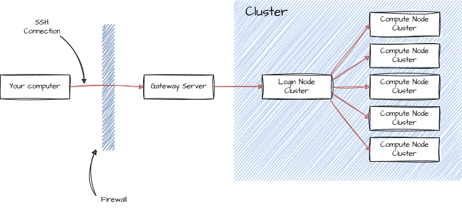

---
title: SSH 
summary: 'SSH is the default protocol to get shell access to other machines in a networks, e.g. a cluster. Many tricks make working with SSH much easier. Here, we are going to discuss a couple of them.'
subtitle: Connections and Agents
authors:
  - admin
tags: ['Tools','Linux', 'Computing']
categories: []
projects: []
draft: false
featured: false
date: '2024-03-10T00:00:00Z'
lastMod: '2024-03-10T00:00:00Z'
image:
  caption: 'generated by DALL-E'
  focal_point: ''
  preview_only: true
---  

Connecting to other computers sounds like useful thing to do:
whether you want to get data from another computer, copy data to another location or just want to send a couple of computations to a cluster, it all involves accessing computers via a network.
SSH (secure shell) is the most popular protocol to do so.

This post is a quick introduction into SSH and a couple of tricks when using it.
We assume that you are working on a UNIX (Mac or Linux) machine.
This post does not cover Windows.
SSH on Windows is not that much fun. You will have to use programs like `PuTTY` and `Pageant` to achieve a similar result.

## TL;DR
- SSH (secure shell) is a protocol to connect to other machines over the networks
- SSH keys are a more secure version to connect to clusters and help you to avoid typing your password hundreds of times a day. 
They consist of two parts: a private and a public part. As the name suggests, the public part goes to the remote machine and lets you connect without typing your password.
- SSH agents store your decrypted private key in memory and you can connect to remote machines without typing your password (after setting up the SSH keys)

## Connecting to a remote machine

Most scientific compute clusters are not directly connected to the internet.
They are either available via the local network, or via a dedicated gateway server.
The cluster itself is usually divided into login nodes and the compute nodes. 
The goal of this post is to get you to the login node.
The inner workings of the cluster will be covered in another post.


As an example, we are going to consider the `xmaris` cluster at the physics department of Leiden university.
If you want to connect to a cluster, you always connect to the login node.
This node manages the connections, runs tests or compiles your code.
It is *not* meant to do any heavy lifting.
The computing nodes are doing that.
However, usually don't connect directly to the computing nodes.
The workload manager will distribute the payload across the nodes.

For security reasons, it is not possible to connect to the cluster's login node.
The institute's network is separated from the internet via a firewall.
In order to connect to the network, you have to connect via a gateway machine, in the case of `xmaris` it is called `styx`.
If you are connecting from inside of the institute's network, you could directly connect to the login node.
That is not possible from outside the network, i.e. from your home.
Luckily, there are clever ways to avoid the double connection by using a jump server (see below).

If you have access, the cluster of the theory group can be accessed via 
```
ssh <cluster_user>@xmaris.lorentz.leidenuniv.nl
```
where `<cluster_user>` is your username on the cluster.
If your username on the cluster is the same as your local username, you can use the shorter command
```
ssh xmaris.lorentz.leidenuniv.nl
```
Additionally, you have to be in the institute network (\emph{eduroam is not enough}).

If not, you first have to log into `styx` with 
```
ssh <cluster_user>@styx.lorentz.leidenuniv.nl
```
and then log into `xmaris`
```
ssh xmaris
```
or activate your VPN.

For further details, have a look [here](https://helpdesk.strw.leidenuniv.nl/wiki/doku.php?id=institute_lorentz:institutelorentz_remoteaccess).
In the next part, we will set up a jump server via SSH to automate the process.

## Proxy Jumps with the SSH config

Naturally, typing your password twice and connecting by hand via another machine is kind of annoying.
So, is there a better way to do this.
Yes, there is!

The `ssh` command on Unix (Mac and Linux) systems is controlled by a local configuration file located under `~/.ssh/config`.
It gives us a lot of useful tools to customize the `ssh` command.
As a first thing, we can define some alias names for the servers. 
Nobody really wants to remember URLs.
If file `~/.ssh/config` does not exist yet, you can just create it. 
It is just a textfile and enter the following text:
```
Host styx
  HostName styx.lorentz.leidenuniv.nl
  User <username>
Host xmaris
  HostName xmaris.lorentz.leidenuniv.nl
  User <username>
  ProxyJump <username>@styx.lorentz.leidenuniv.nl
```

A quick note: You need to substitute \lstinline{<username>} with the your username on the cluster (not your local username on the computer that you are using; the two might coincide).

Now, we can just type `ssh styx` and the `ssh` command will automatically use the correct username and URL to connect to.
However, this still does not solve the problem of typing the password multiple times.
We would like to make the gateway (`styx`) transparent, i.e. we don't notice that we connect via `styx` to `xmaris`.

Luckily, the `config` comes to our rescue. 
We cannot only define aliases for long server names and but also tell SSH how to connect to a certain server.
In our case, we are interested in connecting to `xmaris` via a jump server because the login node of the `xmaris` cluster is not visible to the internet.
By connecting to the gateway `styx` first, we enter the Lorentz Institute network and can connect to the `xmaris` server in a second step.
However, we really couldn't care less about the gateway server. 
It serves only as a crutch to avoid a VPN.
Luckily, SSH has an option for that: `ProxyJump`.

In short, add the command `ProxyJump <username>@styx.lorentz.leidenuniv.nl` to the entry of `xmaris` in your `ssh` config file.

The configuration for the cluster could look like:
```
Host styx
  HostName styx.lorentz.leidenuniv.nl
  User <username>
  ForwardX11 no
Host xmaris
  HostName xmaris.lorentz.leidenuniv.nl
  User <username>
  ProxyJump <username>@styx.lorentz.leidenuniv.nl
  ForwardX11 no
```

Let's note a couple of things:

The line `ForwardX11 no` avoids the forwarding of an X server connection from the cluster to the local computer. 
The X server is responsible for creating a graphical user interface, but who needs a GUI on a cluster anyway?!


So far, so good. But we still have to type our password multiple times.
Isn't there still a better way to do this?

## SSH keypairs
The answer to less passwords are SSH keys with an SSH agent.
Let's start with SSH keys.

If you haven't set up a key pair yet, you will have to type your password twice; once to enter the gateway and then to enter the login node.
You can avoid typing passwords at all if you set up a keypairs for the connections (and store the private key in an agent, more about that later). 


1. Create a key pair  
The command `ssh-keygen` a new key pair. It consists of a private and a public key. 
As the name suggests, the public key will be public and the private key should not be distributed.
Pictorially, you can think of the public key as a lock.
Everybody can have your lock, you don't care too much.
The private key is the key (see graphics above).
You really don't want to loose your key.  
The command `ssh-keygen` will ask for two things: a location and a password for the private key.
The default location for keys is `~/.ssh/` (the folder where also the SSH config lives).
Naming keys in a reasonable manner is good practice. 
It helps you to later recognize which key belongs to which server or service.
One could be named `gitlab`, another one `xmaris`, etc.
For the matter of this example, let's name the key `xmaris-key`.
Please *do* set a password for your private keys.
In case your computer should get compromised, you don't want that people can impersonate you on all clusters that you are working on!

2. Distribute the public key
Now, we have to tell the server about the public key, i.e. we have to send the pictorial lock to the server.
The easiest way to do that is the command `ssh-copy-id`.
In the example of `styx`, this could be `ssh-copy-id ~/.ssh/xmaris-key.pub styx` and then `ssh-copy-id ~/.ssh/xmaris-key.pub xmaris`.
The suffix *.pub* is important here. You want to distribute your public key *not* the private one.
Now, the public part of the `xmaris-key` key is stored on both, `styx` and `xmaris`.

3. Log in with the private key
Finally, you should be able to log into the server with `ssh -i ~/.ssh/xmaris-key xmaris`. The command will not ask for your password anymore, but for the password of the private key.
There is of course a more convenient way to tell SSH which key pair to use. 
You can add it to the `styx` gateway and to `xmaris` by adding the line `IdentityFile <path to file>` to your configuration. 

```
Host styx
  HostName styx.lorentz.leidenuniv.nl
  User <username>
  ForwardX11 no
  IdentityFile ~/.ssh/xmaris-key
Host xmaris
  HostName xmaris.lorentz.leidenuniv.nl
  User <username>
  ProxyJump <username>@styx.lorentz.leidenuniv.nl
  ForwardX11 no
  IdentityFile ~/.ssh/xmaris-key
```

For further insights about SSH public key authentication, I recommend this [beauty](https://www.ssh.com/ssh/public-key-authentication).

## SSH Agents
Although we are using SSH keys now, we still have to type the password of the private key.
As a final step, we will get rid of that password and make working on remote machines completely seamless.

The main ingredient for this step is the SSH agent.
It is a possibility to store decrypted private keys for a certain amount of time.
The default time varies from 24h to 'next shutdown'.

In order to check if you have an SSH agent running on your system by default, please execute `ssh-add -l`.
If you see an error message, then you don't have an agent running and should execute `eval $(ssh-agent)`.
It will start an agent that we can use to store the private keys.

To add keys to the agent, we use the command line program `ssh-add`.
With `ssh-add <path to private key>`, you can add a private key to the agent.
It will store a decrypted version and make it to SSH upon request.
After adding `xmaris-key` with `ssh-add ~/.ssh/xmaris-key`, you should be able to connect to `xmaris` directly with an automatic proxy jump via `styx` by just typing:
```
ssh xmaris
```

Finally, there is a cool feature of SSH keys which is forwarding:
The `ForwardAgent yes/no` in the config enables or disables the forwarding of a local SSH agent to the cluster.
This choice here is entirely personal, yours might differ.
Your local agent can be sent to the cluster via the SSH connection and makes private keys available on the cluster without storing them there.
Personally, I like to have the agent on xmaris to connect to gitlab/github.
This way, I don't have to store my private keys on the cluster permanently. 
They are transferred as part of the agent and I can use them on the cluster as if they were stored there.
For more information on SSH agents, have a look [here](https://www.ssh.com/ssh/agent). 

The final SSH configuration could look like this:

```
Host styx
  HostName styx.lorentz.leidenuniv.nl
  User <username>
  IdentityFile ~/.ssh/xmaris-key
  ForwardX11 no
  ForwardAgent yes
Host xmaris
  HostName xmaris.lorentz.leidenuniv.nl
  User <username>
  ProxyJump <username>@styx.lorentz.leidenuniv.nl
  IdentityFile ~/.ssh/xmaris-key
  ForwardX11 no
  ForwardAgent yes
```

Although the commands in this post are given for a special cluster (`xmaris` with the `styx` gateway), very similar commands should work with other clusters as well.
If in doubt, contact your local cluster administrator and ask for advice.

## Commands used in this post
- `ssh-keygen`: Generate a private-public key pair
- `ssh-copy-id <path_to_public_key> <server>`: Copy the public key to a server
- `eval $(ssh-agent)`: Start an SSH agent
- `ssh-add <path to private key>`: Store a new private key in the agent
- `ssh-add -l`: List all private keys stored in the agent 
- `ssh-add -D`: Delete all private keys from the agent