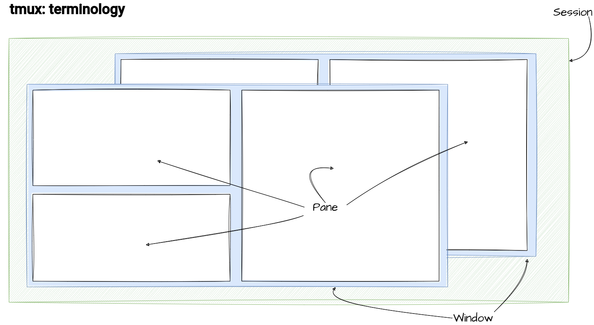

---
title: Tmux
subtitle: 
summary: 'Tmux is a terminal multiplexer, hence the name.
It is meant to make working with remote computers via SSH more enjoyable. And it really delivers!'
authors:
  - admin
tags: ['Tools','Linux']
categories: []
projects: []
draft: false
featured: false
share: false
date: '2024-01-01T00:00:00Z'
lastMod: '2024-01-01T00:00:00Z'
image:
  caption: 'generated by DALL-E'
  focal_point: ''
  preview_only: true
---  
Working on the cluster is often the only way to get computations done in time.
However, there are also a set of hurdles that come with it.
If your internet connection is slow or breaks off, the SSH connection terminates and anything that was executed on the cluster stops in its tracks.

[Tmux](https://github.com/tmux/tmux) (tmux stands for terminal multiplexer) is a program that lives on the remote cluster.
It enhances the functionality of the command line by allowing you to create and manage multiple terminal sessions within a single window. 
A few of the advantages of using a terminal multiplexer like `tmux` or `screen` are:
1. **Commands stay alive**  
Since the commands are executed inside of a `tmux` *session*, they are not directly related to the state of the SSH connection.
Even if your connection breaks down, the session stays alive and you can just reconnect to it as soon as your internet is back.

2. **Keep multiple projects well sorted and continue where you left off**  
`tmux` allows the user to re-attach to previous sessions and keep multiple sessions or windows for different projects.
You can directly keep working where you left of when you disconnected.

3. **Multiple terminals with a single connection**
Using multiple terminal windows in the same shell is one of the main features of `tmux`.
You don't have to connect to the cluster multiple times, just once. The splitting of the terminal happens on the remote server.

In this post, we'll work our way up from the fundamentals to a practical tmux configuration.

## Tmux Basics
To use `tmux`, we have to introduce a bit of language.
Don't worry, we only need three concepts: *sessions*, *windows* and *panes*.
The rough relation of the three is illustrated here:



### Sessions
A tmux session is the highest-level organizational unit. 
It encapsulates a set of windows, panes, and other session-specific settings. 
Since a session lives on the remote machine, it guarantees that your commands are still executed even if you disconnect.
Sessions are particularly useful when you want to maintain the state of your work across different tasks or projects. 
For instance, you could have one tmux session dedicated to coding, another for system administration tasks, and switch between them seamlessly. 
I, personally, tend to use multiple windows (coming up next) instead of multiple sessions.
You can create a named session with 
```bash
tmux new-session -s session_name
```
or, if you just want to get a single session, you can use
```bash
tmux
```

Detaching from a session, aka leaving `tmux,  to return to the regular terminal is achieved with:
```bash
tmux detach
```
or the hotkey `ctrl+a d`.
Note that commands keep being executed if you detach.

If you want to attach to the previous session again, instead of creating a new one with `tmux`, type

```bash
tmux a # `a` like attach
```
into your remote shell (`a` like *attach*).


### Windows

Within a tmux session, windows serve as containers for panes. 
Think of them as individual tabs or views, each representing a specific task or set of related activities. 
You can create a new window using:
```bash
Ctrl-a c # `c` like create
```

This command opens a new window, and you can cycle through windows using:
```bash
Ctrl-a n  # Move to the next window
Ctrl-a p  # Move to the previous window
```

Each window maintains its own set of panes, providing a clean separation of tasks while keeping everything within the same session.

### Panes
Panes are the smallest units in `tmux`, representing individual terminals within a window. 
They enable you to view and interact with multiple terminal sessions simultaneously. 
Panes are created by splitting another pane.
Each windows is created with one big, global pane.
You can create horizontal and vertical splits with
```bash
Ctrl-a -  # Split horizontally
Ctrl-a |  # Split vertically
```

To swap between panes, you can use

```bash
Ctrl-a arrow_key  # Move to the pane in the specified direction
alt + arrow_key  # Move to the pane in the specified direction
```

This capability to divide your terminal real estate allows for efficient multitasking without the need for multiple terminal windows.

This point is maybe the right one for one small admission: 
The shortcuts used in this blog post are *not* the default ones.
I think that splitting vertically is much more related to the pipe symbol '|' than to the double apostrophe '"'.
You can choose your `tmux` keybindings in the `tmux` configuration file.

## A configuration
If you store this file as `~/.tmux.conf` on your remote machine, all of the above commands will work just fine.

```bash {linenos=true}
# remap prefix from 'C-b' to 'C-a'
unbind C-b
set-option -g prefix C-a
bind-key C-a send-prefix

# split panes using | and -
bind | split-window -h
bind - split-window -v
unbind '"'
unbind %

# switch panes using Alt-arrow without prefix
bind -n M-Left select-pane -L
bind -n M-Right select-pane -R
bind -n M-Up select-pane -U
bind -n M-Down select-pane -D

bind -n M-h select-pane -L
bind -n M-l select-pane -R
bind -n M-k select-pane -U
bind -n M-j select-pane -D
```

## Funky features
Finally, one example of a really fun feature in `tmux`. 
You can type in panes of a given window at once.
If you  want to try it, create multiple panes in a given window and enable writing in all panes with
```bash
Ctrl+a :setw synchronize-panes
```
You should be able to tab complete after the 'sy' of `synchronize-panes`.
If you type now, all text will be repeated across all panes.
Since `synchronize-panes` is like a flag, you can disable it again with the same command.

Happy tmuxing and a happy New Year!

## Other resources
- [tmux] (https://github.com/tmux/tmux/wiki)
- [Crash course] (https://thoughtbot.com/blog/a-tmux-crash-course)
- [Windows and Panes](https://arcolinux.com/everthing-you-need-to-know-about-tmux-panes/#:~:text=A%20Window%20holds%20one%20or,can%20have%20several%20panes%20open.)
