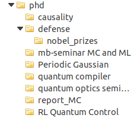
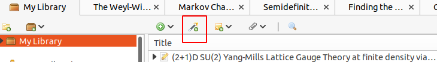

---
title: Zotero -- Part 1
subtitle: Basics of citation management
summary: 'Zotero allows you to organize bibliographic information and annotate/tag papers. Stop maintaining your own personal .bib file!'
authors:
  - admin
tags: ['Tools','LaTeX','Bibliography']
categories: []
projects: []
draft: false
featured: false
date: '2023-08-14T00:00:00Z'
lastMod: '2023-08-14T00:00:00Z'
image:
  caption: 'generated by DALL-E'
  focal_point: ''
  preview_only: true
---  

Research is usually based on the ideas of others that came before (standing on the shoulders of giants -- greetings from Newton). And there are usually a lot of people before with lots of ideas resulting in many papers.
So, how do we keep track of that mess? One option is to put all the papers in one big folder, name them somewhat semi-consistently and maintain a huge [bibtex](https://www.bibtex.org/) file by hand. Somehow, this does not feel like the most efficient way.

If you are fed up with dealing with citations by hand: what about using a bibliography management program like Zotero, Mendeley or Citavi? There are other programs doing a similar job, but I am using Zotero, so this what I write about.
A bibliography manager is doing nothing special, it is just a program that organizes citations, generates bibtex files and is meant to deal with annotations. Think about it as an email program: you are not reading your emails in only-text on the commandline either. You have an email client that displays them in a nice fashion and makes working with them much easier. The bibliography manager has the same job (just for citations instead of emails).
So, how does it work?

# TL;DR
Zotero can
- manage your citations
- create bibtex files of a subset or your whole library
- find duplicates, and remove them
- store annotation, tags and notes
- sync your bibliography between different devices (in the next post)
- share libraries between colleagues and co-authors (in the next post)
In short: it is way better than handling bibtex files by hand!

# Installation
Well, we have to start with the installation. In short: it is a computer program like any other, I am sure you can figure it out. Here is the [download page](https://www.zotero.org/download/). Make sure to install also the extension for your browser. It seamlessly integrates Zotero into your browsing workflow. You can just import an arxiv article or a paper to your library with one click.

Talking about installation, there is a really handy plugin called 'betterBibTex' available from [here](https://retorque.re/zotero-better-bibtex/). It helps you to manage citation keys and gives you a bit more freedom in Zotero.

# Idea and Principles
Zotero works like a library (and the main body of bibliography items is actually called library). To structure your citations, you can group them in so-called collections. For me, a collection is usually a project or a common subject. Here is an example from my Zotero  

Being part of a collection is not exclusive. You can happily add your favorite paper to all collections where it is needed. In reverse, deleting a paper from a collection does *not* delete it from your library. You just state that it is not part of this particular group (aka collection) anymore.

# Inserting citations
But how do we get bibliography items to work with in the first place? There are two main ways to import bibliography items into Zotero: import from a .bib file, import via browser, and import via DOI.

1. If you are just getting started with Zotero, a good way to import all your usual bibliography items is to import your current bibtex file. You can do so by (`File->Import` and then follow the prompts). The result can either be a new collection with all your imported bibliography items or they are just dumped into your library. This method will get you started, but is horrible for an everyday workflow.

2. But Zotero got you covered: Zotero offers a very convenient browser plugin already mentioned above (Zotero Connector). If you are reading an arxiv preprint or you are standing on a journal webpage, you can import the publication with a single click on the small button here  If the button does not show up, it might be hidden in the sub-menu (the puzzle piece) to the right.

3. In case you just have a DOI or an arxiv identifier lying around, you can directly import it into Zotero with the magic wand. Just enter your identifier in the appearing prompt and Zotero will take care of the rest. It is a bit like magic...

In my everyday workflow, I am mostly using the Zotero Connector to add citations to my library, sometimes the magic wand.

Obviously, you can also create a new bibliography item by hand (the green plus) and insert all information manually. You can, but why would you?

# Tagging and notes
Reading papers is one thing, finding a paper again is something totally different. Regularly, I find myself in the situation that I remember parts of the contents of a paper, but I do not really remember the full title, let alone the DOI.
The tagging feature in Zotero makes it easy to classify papers into subgroups. Tags can be anything from a method (Monte Carlo, tensor networks, exact computation, ..) or a field (quantum optics, machine learning, etc). If you know the field some of the key results, you will be able to quickly isolate the paper from the bunch.

Tagging is a rather rough classification. Luckily, Zotero also supports more detailed annotations (which can be synchronized across multiple devices). The annotations can be directly inserted into the PDF and are stored as part of your Zotero library. If you know PDF annotations, you can work with Zotero annotations.

Lastly, if you really want to write a long note about a paper, you can also do that. Zotero supports notes (basically rich-text files) that are connected to a bibliographic entry.

# Exporting bibtex
When writing a paper, having the correct citations in Zotero is not enough. We need a bibtex (or biblatex) file in the end. The plugin makes it easy to export to bibTeX and bibLaTeX with a specific citations keys (in case you have to match a certain convention by your coauthors). The citation key format can be adapted in the preferences (`Edit->Preferences->Better BibTex`).
You can export a whole collection (or your whole library) by right-clicking and selecting `Export Collection` and then selecting `BetterBibLaTeX` as a format (or `BetterBibTex` if you need bibTeX).

In this blog post, we introduced a bibliography manager (Zotero) instead of keeping a bunch of PDFs around and curating a personal bibTeX file. Zotero allows painless adding, annotating and tagging of references.
In the next post, we will cover how to synchronize your library between different devices and how to collaborate in Zotero with your co-authors directly.