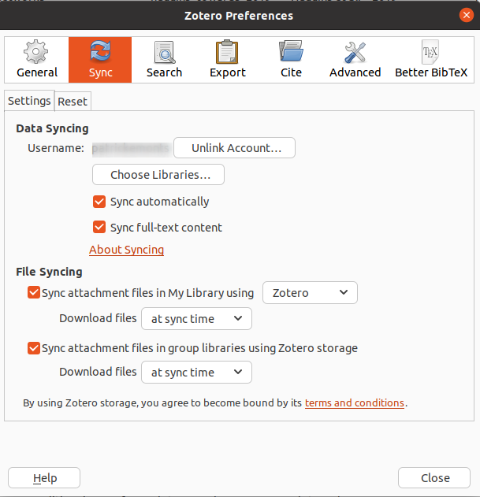
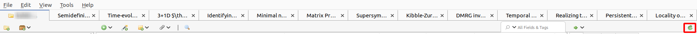
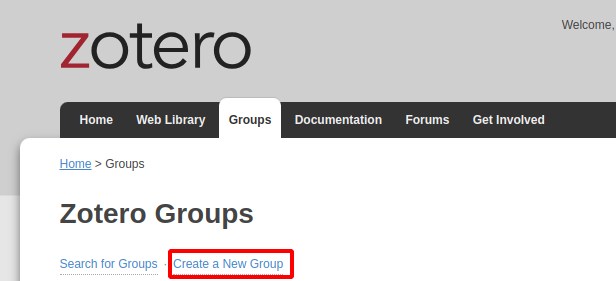
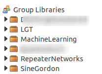

---
title: Zotero -- Part 2
subtitle: Collaboration in Zotero
summary: 'Zotero does not only allow you to maintain your own bibliography, it also allows you to share it with your collaborators.'
authors:
  - admin
tags: ['Tools','LaTeX','Bibliography']
categories: []
projects: []
draft: false
featured: false
date: '2023-10-23T00:00:00Z'
lastMod: '2023-10-23T00:00:00Z'
image:
  caption: 'generated by DALL-E'
  focal_point: ''
  preview_only: true
---  
In the previous Zotero [post](), we had a look at the basic features of Zotero, like managing a bibliography and exporting the bibliography as a bibTeX file.
In this post, we move to a couple of more advanced features of Zotero like syncing and sharing libraries.

# Syncing Libraries
After installing Zotero on a computer, you can locally maintain you library on that computer.
Zotero would be even more useful if your library could travel with you and you could edit your library from everywhere, whether your computer is with you or not.
This is precisely what the syncing feature of Zotero does for you.

To use enable syncing of your library between different machines and with your Zotero account, you need a Zotero account (little suprise).
If you did not create one already, you can create one [here]().
By creating an account, you automatically get 300MB free storage (check [here](https://www.zotero.org/storage)).
That may not sound like much, citations alone do not use a lot of memory.
As soon as you start attaching PDFs to your growing library, you might need a bit more (and a paid subscription).
Personally, I am using a paid subscription and I have not regretted it so far.
Of course, you could also try to sync externally by sharing the data folder of zotero (usually located at `~\.zotero`) via some other service.
However, there might be some issues with merging if notes or PDF version are out of sync.

To enable syncing, you have to connect your Zotero account to your local Zotero installation.
You can do so by navigating to the `Sync` tab in the preferences (`Edit`->`Preferences`).
The window should look something like this

After connecting to your account, the syncing of the library should start automatically.
If not, you can click on the green sync icon in the upper right corner.

# Shared Libraries
When collaborating on a paper, it is sometimes cumbersome to collect all the citations for the paper.
Everyone just copy-pastes citations into a shared bibliography file and before you can blink twice, 15 conventions for citation keys are used and 3 citations appear multiple times throughout the bibliography (of course with different keys).
To avoid a mess in the bibliography file, it is easier to manage shared libraries directly in Zotero.

Shared libraries in Zotero can either be public (like this [curated zotero library for TDA applications](https://www.zotero.org/groups/2425412/tda-applications)) or private, i.e. only visible to members of the library.
To create a shared library (called group in Zotero), you log into the web-interface of Zotero.
Under the tab `groups`, you can create a new group and add other Zotero users to the group.
A quick word of caution: the memory consumed by a group is deducted from the storage of the group's owner (i.e. the creator).

After your local Zotero client synced, you will see your new group as a new library in the left column:

You can use it like every your personal library. 
The only difference: Every change you make is propagated to all other members of the group.
That includes tags, notes and annotations of papers.